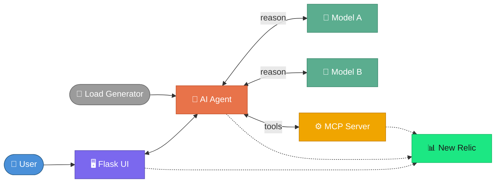
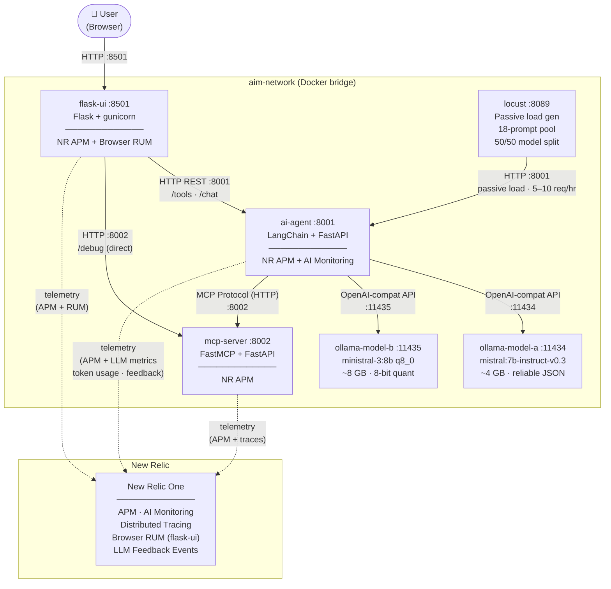

# AIM Demo — Architecture Diagram

## High-Level Overview



---

## Service Overview

| Service | Port | Technology | Role |
|---|---|---|---|
| **flask-ui** | 8501 | Flask 3.0 + gunicorn | Web UI (Home, Tools, Chat, Debug) |
| **ai-agent** | 8001 | LangChain + FastAPI | Reasoning engine with tool calling |
| **mcp-server** | 8002 | FastMCP + FastAPI | Mock system operation tools (6 tools) |
| **ollama-model-a** | 11434 | Ollama · mistral:7b-instruct-v0.3 | LLM Model A (~4 GB) |
| **ollama-model-b** | 11435 | Ollama · ministral-3:8b q8_0 | LLM Model B (~8 GB) |
| **locust** | 8089 | Locust 2.43.0 | Passive load generator (5–10 req/hr) |

---

## Architecture Diagram



---

## Distributed Trace Flow

```
Browser (RUM)
  └─► flask-ui  (NR Python Agent · W3C trace context)
        └─► ai-agent  (NR Python Agent · AI Monitoring)
              ├─► ollama-model-a / ollama-model-b  (LLM call)
              └─► mcp-server  (NR Python Agent · tool invocations)
```

---

## Key Interactions

| From | To | Protocol | Purpose |
|---|---|---|---|
| User | flask-ui | HTTP | Web interface |
| flask-ui | ai-agent | HTTP REST | Tool workflows + chat |
| flask-ui | mcp-server | HTTP | Debug page (direct tool testing) |
| ai-agent | ollama-model-a/b | OpenAI-compat HTTP | LLM inference (A/B model selection) |
| ai-agent | mcp-server | MCP over HTTP | Tool execution (6 mock system ops) |
| locust | ai-agent | HTTP | Background load, 5–10 req/hr |
| flask-ui / ai-agent / mcp-server | New Relic | HTTPS | APM telemetry + AI metrics |
